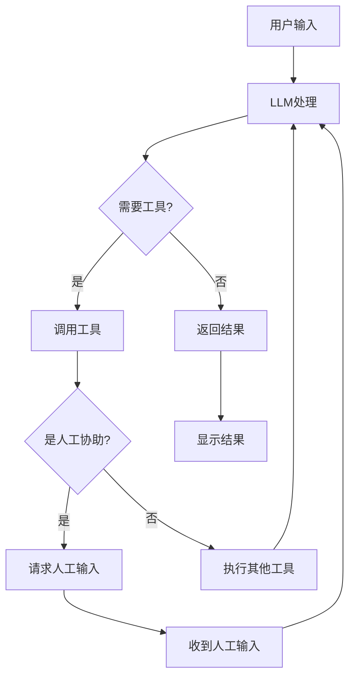

# 人机协作聊天机器人使用说明

## 🤖 功能特点

这个聊天机器人支持**人机协作**模式，当AI遇到需要人类帮助的情况时，会主动请求人工协助。

## 🔧 主要组件

### 1. 工具配置
- **TavilySearch**: 网络搜索工具
- **human_assistance**: 人工协助工具，当AI需要帮助时调用

### 2. 人机协作流程
```
用户输入 → AI处理 → 需要帮助? → 请求人工协助 → 继续处理 → 返回结果
```

## 🚀 使用方法

### 启动程序
```bash
python test.py
```

### 交互示例

#### 普通对话
```
User: 你好，请介绍一下LangGraph
Assistant: LangGraph是一个用于构建有状态的、多参与者应用程序的库...
```

#### 触发人工协助
```
User: 我需要关于最新AI技术的专业建议
Assistant: [调用搜索工具获取信息]
🤝 AI正在请求人工协助...
💭 请求帮助: 需要专家对最新AI技术趋势的深度分析
👤 请提供帮助 (或输入 'skip' 跳过): 根据我的专业经验，当前AI技术主要发展方向包括...
🔄 继续处理...
Assistant: 基于专家提供的信息，我来为您详细分析...
```

## ⚙️ 配置要求

### 环境变量
创建 `.env` 文件：
```env
# 硅基流动API密钥 (必需)
OPENAI_API_KEY=your_siliconflow_api_key

# Tavily搜索API密钥 (可选)
TAVILY_API_KEY=your_tavily_api_key
```

### 依赖包
```bash
pip install -r requirements_test.txt
```

## 💡 使用技巧

### 1. 触发人工协助的情况
- AI遇到复杂的专业问题
- 需要最新信息但搜索结果不够
- 需要人类判断或创意建议

### 2. 人工协助最佳实践
- **提供具体信息**: 给出详细、准确的帮助
- **使用专业术语**: 如果是专业领域，使用准确的术语
- **结构化回答**: 使用列表、段落等结构化格式

### 3. 命令
- `quit`, `exit`, `q`: 退出程序
- `skip`: 跳过当前的人工协助请求

## 🔍 故障排除

### 1. 如果AI不请求帮助
AI会根据情况自动判断是否需要人工协助。你可以明确要求：
```
User: 我需要专家意见，请调用人工协助工具
```

### 2. 如果遇到错误
检查：
- API密钥是否正确配置
- 网络连接是否正常
- 依赖包是否完整安装

### 3. 调试模式
如果需要查看详细的执行过程，可以在代码中添加日志输出。

## 📊 架构说明



## 🎯 示例场景

### 场景1: 技术咨询
```
User: 我想了解最新的大语言模型架构设计
AI: [搜索最新信息] → [请求专家协助] → [整合信息提供答案]
```

### 场景2: 创意建议
```
User: 帮我设计一个AI产品的营销策略
AI: [分析需求] → [请求营销专家协助] → [生成个性化策略]
```

### 场景3: 复杂问题解决
```
User: 我的代码有性能问题，如何优化？
AI: [分析代码] → [请求技术专家协助] → [提供优化建议]
```

这个人机协作系统让AI能够在需要时获得人类专家的帮助，从而提供更准确、更有价值的回答。
